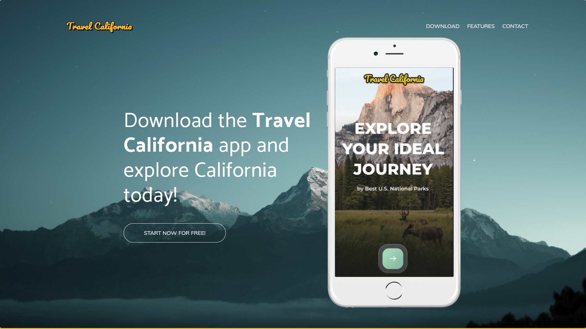

# travel-california

### View project [here](https://sam-xander.github.io/travel-california/)

The Travel California project involved creating a prototype website using [Bootstrap](https://getbootstrap.com/), [Figma](https://www.figma.com/) and [Font Awesome](https://fontawesome.com/).
I created the site with Bootstrap v4.6 and icons from Font Awesome using designs and guidelines sent from the designer on Figma.
The intention was to quickly prototype a website that could be used as a proof of concept.

View mock-up on Figma [here](https://www.figma.com/file/JCMqEbCMoE5K5aK71Q9hZM/Redline-Zeplin-Wireframe-Template?node-id=0%3A1)

---

